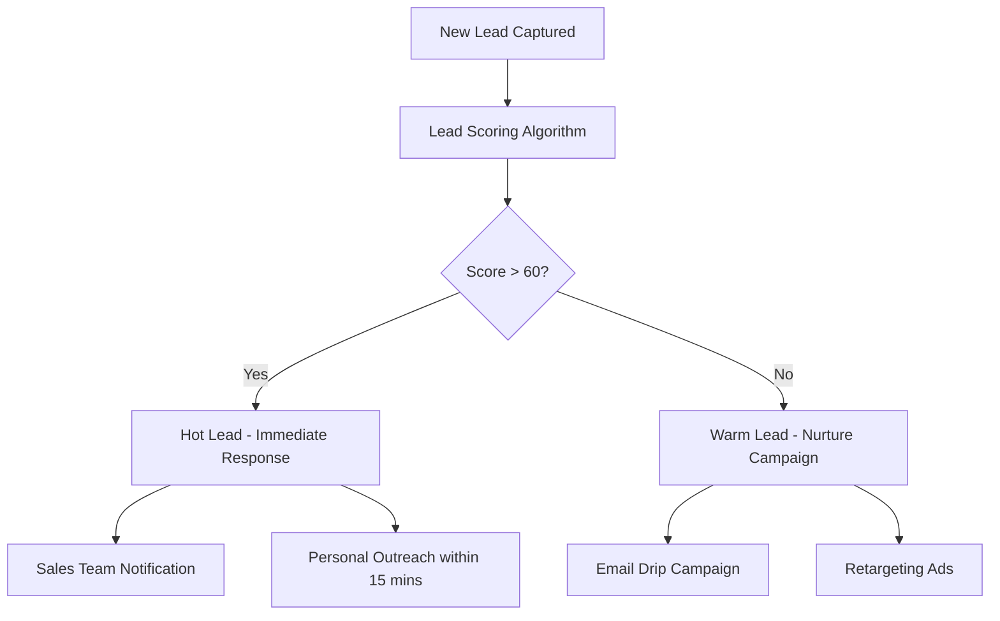

# ConversAI Labs - Automated Marketing Strategy & Implementation Guide

## 📊 Executive Summary

This document outlines a comprehensive automated marketing strategy for ConversAI Labs, focusing on scaling lead generation, nurturing prospects, and converting them into paying customers for our AI agent builder platform.

**Current State:**
- 50+ active businesses using the platform
- Multi-tier pricing (₹9,999 - ₹83,999/month)
- 14+ industry-specific solutions
- Multi-channel AI agents (Voice, WhatsApp, Email)

**Opportunity:**
- Growing AI automation market in India
- Businesses seeking 24/7 lead qualification
- High ROI potential (1,567% claimed)

---

## 🎯 Target Audience Analysis

### Primary Segments

#### 1. **Small-Medium Businesses (SMBs)**
- **Profile**: 10-50 employees, growing revenue
- **Pain Points**: Missing leads, slow response times, limited staff
- **Target Industries**: Real Estate, Home Services, Healthcare
- **Pricing Fit**: Starter/Professional plans (₹9,999-₹26,999)

#### 2. **Enterprise Companies**
- **Profile**: 100+ employees, established processes
- **Pain Points**: Scaling customer support, integration needs
- **Target Industries**: Finance, Technology, Automotive
- **Pricing Fit**: Enterprise plan (₹83,999+)

#### 3. **Industry-Specific Businesses**
- **Healthcare**: Clinics, hospitals, wellness centers
- **Real Estate**: Agencies, developers, brokers
- **Home Services**: Contractors, repair services, maintenance
- **Financial Services**: Insurance, loans, wealth management

### Customer Journey Mapping

```
Awareness → Interest → Consideration → Intent → Purchase → Onboarding → Advocacy
    ↓         ↓           ↓            ↓        ↓          ↓           ↓
  Blog      Demo       Case Study    Trial    Contact    Setup     Referral
  SEO       Video      Comparison    Quote    Sales      Support   Reviews
  Ads       Webinar    ROI Calc      Form     Call       Training  Testimonials
```

---

## 🔄 Marketing Automation Workflows

### 1. **Lead Capture & Qualification System**

#### Current Lead Sources
- Website contact forms (multiple CTAs)
- Industry-specific landing pages
- Pricing page inquiries
- Demo requests
- Free trial signups

#### Automated Lead Scoring
```javascript
Lead Score = Base Score + Industry Weight + Company Size + Urgency + Engagement
```

**Scoring Criteria:**
- **Industry Match**: +20 points (target industries)
- **Company Size**: +15 points (10-500 employees)
- **Immediate Need**: +25 points ("urgent", "ASAP" in notes)
- **Budget Indicators**: +20 points (mentions pricing tiers)
- **Multiple Touchpoints**: +10 points per additional form submission

#### Lead Qualification Workflow


### 2. **Email Marketing Automation**

#### A. Welcome Series (5-email sequence)
**Email 1: Immediate Response (Sent instantly)**
```
Subject: "Thanks for your interest in AI agents - Let's get you started"

Hi [Name],

Thanks for reaching out! I've got some exciting news about how AI agents can transform your [Industry] business.

Quick question: What's the biggest challenge you face with lead qualification right now?

Best,
[Sales Rep Name]
ConversAI Labs Team

P.S. Ready to see it in action? Book a 15-minute demo: [Calendar Link]
```

**Email 2: Social Proof (Day 1)**
```
Subject: "How [Similar Company] increased leads by 300% with AI agents"

Case study featuring industry-specific success story
Include ROI calculator
CTA: Schedule demo
```

**Email 3: Educational Content (Day 3)**
```
Subject: "The 5-minute guide to AI agent setup"

How-to guide with screenshots
Video walkthrough
CTA: Start free trial
```

**Email 4: Objection Handling (Day 5)**
```
Subject: "Common concerns about AI agents (and why they're not valid)"

Address: Cost, complexity, customer acceptance
Include testimonials
CTA: Contact sales
```

**Email 5: Final Push (Day 7)**
```
Subject: "Last chance: 50 free calls + setup assistance"

Limited-time offer
Urgency-based CTA
Multiple contact options
```

#### B. Industry-Specific Nurture Campaigns

**Real Estate Campaign:**
- Email 1: "Never miss a property inquiry again"
- Email 2: "Case study: Mumbai realtor closes 40% more deals"
- Email 3: "Lead qualification questions for real estate"
- Email 4: "Integration with popular CRMs"

**Healthcare Campaign:**
- Email 1: "HIPAA-compliant AI for patient inquiries"
- Email 2: "Reduce appointment no-shows by 60%"
- Email 3: "Multilingual support for diverse patients"
- Email 4: "Medical industry compliance guide"

#### C. Win-Back Campaign (Inactive Leads)
- Email 1: "We miss you - what changed?" (Day 30)
- Email 2: "New features you might have missed" (Day 35)
- Email 3: "Special pricing just for you" (Day 40)

### 3. **WhatsApp Marketing Automation**

#### Immediate Response System
```
New WhatsApp inquiry → Auto-response within 30 seconds
→ Qualify lead with 3 questions
→ Route to appropriate team member
→ Schedule follow-up in CRM
```

**Auto-Response Template:**
```
Hi! Thanks for your WhatsApp message about AI agents.

Quick questions to help you better:
1. What industry are you in?
2. How many leads do you get per month?
3. What's your biggest challenge with current lead handling?

I'll connect you with our specialist right away! 🚀

- ConversAI Team
```

### 4. **Retargeting & Remarketing**

#### Google Ads Retargeting Audiences
- **Website Visitors (30 days)**: General remarketing
- **Pricing Page Visitors**: High-intent audience
- **Demo Watchers**: Warm prospects
- **Industry Page Visitors**: Industry-specific ads
- **Cart Abandoners**: Free trial started but not completed

#### Facebook/LinkedIn Retargeting
- **Lookalike Audiences**: Based on existing customers
- **Custom Audiences**: Website visitors, email subscribers
- **Behavioral Targeting**: Technology adopters, business decision-makers

---

## 📱 Multi-Channel Campaign Strategy

### 1. **Search Engine Marketing (SEM)**

#### Google Ads Campaigns

**Campaign 1: High-Intent Keywords**
```
Keywords: "AI agent builder", "automated lead qualification", "voice bot for business"
Ad Copy: "Build AI Agents in 10 Minutes | 50 Free Calls | No Coding Required"
Landing Page: Homepage with demo CTA
Budget: ₹50,000/month
```

**Campaign 2: Industry-Specific**
```
Keywords: "real estate lead qualification", "healthcare appointment booking AI"
Ad Copy: "AI Agents for [Industry] | 24/7 Lead Capture | Free Demo"
Landing Page: Industry-specific pages
Budget: ₹75,000/month
```

**Campaign 3: Competitor Keywords**
```
Keywords: "[Competitor] alternative", "better than [Competitor]"
Ad Copy: "Switch to ConversAI | 50% More Features | Same Price"
Landing Page: Comparison page
Budget: ₹25,000/month
```

#### Search Engine Optimization (SEO)

**Target Keywords:**
- Primary: "AI agent builder India" (1,000 searches/month)
- Secondary: "automated lead qualification" (800 searches/month)
- Long-tail: "how to build voice bot for business" (200 searches/month)

**Content Strategy:**
- Weekly blog posts on AI automation
- Industry-specific guides
- Case studies and success stories
- Technical documentation and tutorials

### 2. **Social Media Marketing**

#### LinkedIn Strategy
- **Organic Content**: 3 posts/week
  - Industry insights and trends
  - Customer success stories
  - Behind-the-scenes content
- **LinkedIn Ads**: Sponsored content to decision-makers
- **Lead Gen Forms**: In-platform lead capture

#### YouTube Strategy
- **Channel Focus**: AI automation tutorials
- **Video Types**:
  - Product demos (5-10 minutes)
  - Industry use cases (3-5 minutes)
  - Customer testimonials (2-3 minutes)
- **Publishing Schedule**: 2 videos/week

### 3. **Content Marketing**

#### Blog Content Calendar

**Week 1: Educational**
- "Complete Guide to AI Agent Setup"
- "10 Questions Every AI Agent Should Ask"

**Week 2: Industry-Specific**
- "AI Agents for Real Estate: Complete Implementation Guide"
- "Healthcare AI: HIPAA Compliance and Best Practices"

**Week 3: Case Studies**
- "How [Company] Increased Conversion by 300%"
- "ROI Analysis: ₹1 Spent on AI = ₹15 Revenue"

**Week 4: Product Updates**
- "New Features This Month"
- "Integration Spotlight: CRM Connections"

#### Downloadable Resources
- **Lead Magnets**:
  - "AI Agent Implementation Checklist"
  - "Lead Qualification Questions by Industry"
  - "ROI Calculator Spreadsheet"
  - "Integration Guide for Popular CRMs"

---

## 🔧 Marketing Technology Stack

### Core Platforms

#### 1. **Customer Relationship Management (CRM)**
**Recommended: HubSpot or Pipedrive**
- Lead scoring and routing
- Email automation
- Deal pipeline management
- Integration with existing Supabase database

#### 2. **Email Marketing Platform**
**Recommended: Mailchimp or ConvertKit**
- Drip campaigns
- Segmentation
- A/B testing
- Analytics and reporting

#### 3. **Marketing Automation**
**Recommended: Zapier + Native Integrations**
- Connect all tools
- Trigger-based workflows
- Data synchronization

#### 4. **Analytics & Tracking**
- **Google Analytics 4**: Website behavior
- **Google Tag Manager**: Event tracking
- **Facebook Pixel**: Social media retargeting
- **Hotjar**: User behavior analysis

### Implementation Roadmap

#### Phase 1: Foundation (Weeks 1-2)
- [ ] Set up CRM system
- [ ] Install tracking pixels
- [ ] Create email templates
- [ ] Set up basic automations

#### Phase 2: Content & Campaigns (Weeks 3-4)
- [ ] Launch blog content calendar
- [ ] Create lead magnets
- [ ] Set up Google Ads campaigns
- [ ] Launch social media presence

#### Phase 3: Advanced Automation (Weeks 5-6)
- [ ] Implement lead scoring
- [ ] Set up retargeting campaigns
- [ ] Create industry-specific nurture sequences
- [ ] Launch referral program

#### Phase 4: Optimization (Weeks 7-8)
- [ ] A/B test email campaigns
- [ ] Optimize ad performance
- [ ] Refine lead scoring model
- [ ] Scale successful campaigns

---

## 📊 Key Performance Indicators (KPIs)

### Lead Generation Metrics
- **Monthly Qualified Leads (MQLs)**: Target 500/month
- **Lead-to-Customer Conversion Rate**: Target 15%
- **Cost Per Lead (CPL)**: Target ₹500
- **Customer Acquisition Cost (CAC)**: Target ₹7,500

### Revenue Metrics
- **Monthly Recurring Revenue (MRR)**: Track growth
- **Customer Lifetime Value (CLV)**: Target ₹2,50,000
- **Average Deal Size**: Track by plan type
- **Time to Close**: Target 14 days

### Marketing Channel Performance
- **Organic Search**: 30% of total leads
- **Paid Search**: 25% of total leads
- **Social Media**: 20% of total leads
- **Email Marketing**: 15% of total leads
- **Referrals**: 10% of total leads

### Engagement Metrics
- **Email Open Rate**: Target 25%
- **Click-Through Rate**: Target 5%
- **Website Conversion Rate**: Target 3%
- **Demo-to-Sale Conversion**: Target 40%

---

## 💰 Budget Allocation

### Monthly Marketing Budget: ₹2,00,000

#### Paid Advertising (60% - ₹1,20,000)
- Google Ads: ₹70,000
- Facebook/LinkedIn Ads: ₹30,000
- YouTube Ads: ₹20,000

#### Tools & Software (20% - ₹40,000)
- CRM Platform: ₹15,000
- Email Marketing: ₹8,000
- Analytics Tools: ₹5,000
- Automation Tools: ₹12,000

#### Content Creation (15% - ₹30,000)
- Blog Writing: ₹15,000
- Video Production: ₹10,000
- Design Assets: ₹5,000

#### Team & Operations (5% - ₹10,000)
- Training & Certifications: ₹5,000
- Miscellaneous: ₹5,000

---

## 🚀 Quick Wins (30-Day Implementation)

### Week 1: Immediate Setup
1. **Install tracking pixels** on all pages
2. **Create Google My Business** profile
3. **Set up basic email automation** for new leads
4. **Launch Google Ads** for high-intent keywords

### Week 2: Content Foundation
1. **Publish 4 blog posts** (one per target industry)
2. **Create lead magnet** (AI implementation checklist)
3. **Set up LinkedIn Company Page**
4. **Launch email welcome series**

### Week 3: Paid Campaigns
1. **Launch Facebook/LinkedIn ads**
2. **Create YouTube channel** with 3 demo videos
3. **Set up retargeting campaigns**
4. **Implement WhatsApp auto-responder**

### Week 4: Optimization
1. **A/B test ad copy** and landing pages
2. **Analyze performance** and adjust budgets
3. **Refine targeting** based on early data
4. **Scale successful campaigns**

---

## 🔄 Automation Workflows Detail

### Workflow 1: New Website Lead
```
Trigger: Form submission on website
→ Send immediate thank you email
→ Add to CRM with lead source
→ Score lead based on criteria
→ If score > 60: Ping sales team via Slack
→ If score < 60: Add to nurture campaign
→ Create task for follow-up call within 24 hours
```

### Workflow 2: Demo Request
```
Trigger: Demo form submission
→ Send calendar booking link immediately
→ Add to high-priority CRM pipeline
→ Send demo preparation email 1 day before
→ Send demo recording and follow-up 1 hour after
→ If no response in 3 days: Send case study email
→ If no response in 7 days: Transfer to nurture campaign
```

### Workflow 3: Trial Signup
```
Trigger: Free trial account created
→ Send welcome email with setup guide
→ Create onboarding task sequence
→ Send setup reminder after 2 days if inactive
→ Send success tips on day 5
→ Send upgrade offer on day 12
→ If trial expires: Send win-back campaign
```

### Workflow 4: Abandoned Cart/Demo
```
Trigger: Started demo but didn't complete
→ Wait 1 hour
→ Send "Finish your demo" email
→ Wait 1 day
→ Send success story email
→ Wait 3 days
→ Send limited-time offer email
→ Add to retargeting audience
```

---

## 📈 Scaling Strategy

### Month 1-3: Foundation & Testing
- Establish basic automation workflows
- Test different channels and messaging
- Build initial content library
- Gather performance data

### Month 4-6: Optimization & Scale
- Double down on high-performing channels
- Launch advanced automation workflows
- Expand content production
- Introduce referral program

### Month 7-12: Growth & Expansion
- Enter new geographic markets
- Launch partner/affiliate program
- Develop advanced product features for marketing
- Build thought leadership platform

---

## 🎯 Success Metrics & Reporting

### Weekly Reports
- Lead generation by source
- Conversion rates by channel
- Campaign performance metrics
- Pipeline progression

### Monthly Reviews
- ROI analysis by channel
- Customer acquisition cost trends
- Lifetime value calculations
- Market expansion opportunities

### Quarterly Planning
- Budget reallocation based on performance
- New channel exploration
- Product marketing alignment
- Competitive analysis updates

---

## 🔧 Technical Implementation

### Website Enhancements Needed

#### 1. **Enhanced Lead Capture**
```javascript
// Advanced lead scoring implementation
const calculateLeadScore = (leadData) => {
  let score = 0;
  
  // Industry scoring
  const highValueIndustries = ['real-estate', 'healthcare', 'finance'];
  if (highValueIndustries.includes(leadData.industry)) score += 20;
  
  // Company size scoring
  if (leadData.company_size === 'medium') score += 15;
  if (leadData.company_size === 'large') score += 25;
  
  // Urgency scoring
  const urgentKeywords = ['urgent', 'asap', 'immediately', 'soon'];
  if (urgentKeywords.some(keyword => 
    leadData.notes?.toLowerCase().includes(keyword))) score += 25;
  
  return score;
};
```

#### 2. **Advanced Analytics Tracking**
```javascript
// Enhanced event tracking for marketing attribution
gtag('event', 'lead_generated', {
  'lead_source': source,
  'industry': industry,
  'lead_score': calculatedScore,
  'value': estimatedValue
});
```

#### 3. **Personalization Engine**
- Dynamic content based on industry
- Personalized pricing displays
- Industry-specific testimonials
- Geo-targeted messaging

### API Integrations Required

#### 1. **CRM Integration**
- Sync leads from website to CRM
- Update lead scores automatically
- Trigger sales notifications

#### 2. **Email Platform Integration**
- Add new leads to appropriate sequences
- Track email engagement
- Sync unsubscribes

#### 3. **Analytics Integration**
- Send conversion events to GA4
- Track multi-touch attribution
- Calculate campaign ROI

---

This comprehensive automated marketing strategy provides a roadmap for scaling ConversAI Labs' growth through systematic lead generation, nurturing, and conversion processes. The strategy focuses on measurable results, automation efficiency, and continuous optimization based on data-driven insights.

**Next Steps:**
1. Review and approve overall strategy
2. Prioritize implementation phases
3. Allocate budget and resources
4. Begin Phase 1 implementation
5. Set up tracking and reporting systems

Would you like me to elaborate on any specific section or create additional implementation guides for particular workflows?